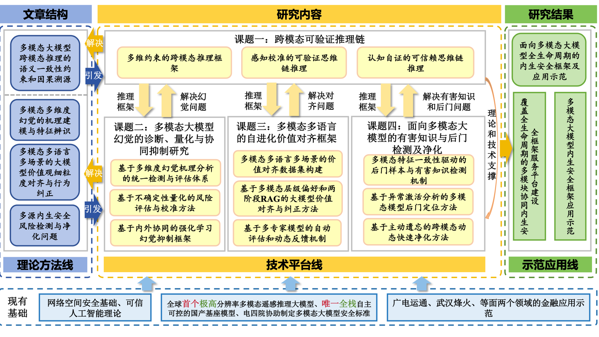
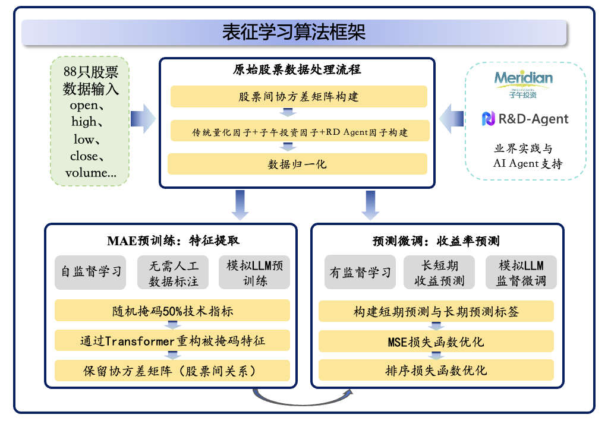
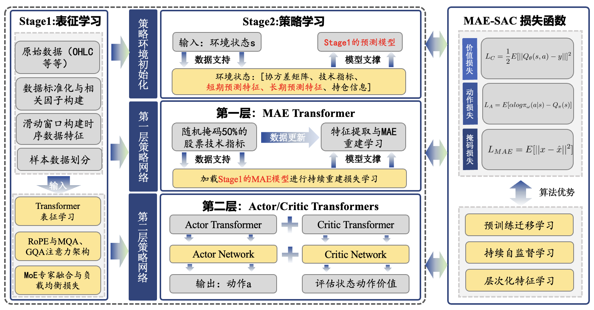
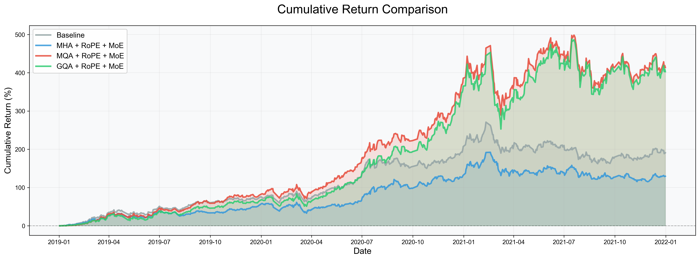
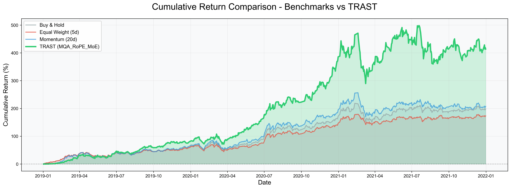

# TRAST: Transformer-enhanced Reinforcement Learning Framework for Assets Cross-Section and Timing

## 项目简介

TRAST (Transformer-enhanced Reinforcement Learning Framework for Assets Cross-Section and Timing) 是一个基于深度强化学习的自动化股票交易系统，为本人的毕业论文代码。

### 主要特点

- **创新架构设计**: 支持多种Transformer架构变体，包括MHA、MQA、GQA等注意力机制，RoPE、MoE等架构
- **两阶段训练策略**:
  - 阶段1: 表征学习，通过MAE学习股票特征表示
  - 阶段2: 策略学习，基于表征进行强化学习策略训练
- **丰富的特征工程**: 集成多种技术指标、子午投资因子和RDA因子
- **全面的基准测试**: 与经典策略进行对比评估

## 项目结构

```
TRAST/
├── data/CSI/                              # CSI 300指数股票数据（94只股票）
├── stage1_representation/                 # 阶段1：表征学习
│   ├── checkpoints/                       # 训练保存的模型
│   ├── exp/                               # 实验脚本
│   ├── models/                            # 模型定义
│   ├── utils/                             # 工具函数
│   ├── data/                              # 数据处理
│   ├── train.py                           # 主训练脚本
│   └── config.py                          # 配置文件
├── stage2_policy/                         # 阶段2：策略学习
│   ├── models/                            # RL模型
│   ├── sac/                               # SAC算法
│   ├── results/                           # 训练结果
│   ├── train.py                           # 第二阶段训练脚本
│   ├── preprocess.py                      # 数据预处理
│   └── config.py                          # 配置文件
├── benchmarks/                            # 基准策略测试
│   ├── benchmark_strategies.py            # 基准策略实现
│   ├── config.py                          # 基准测试配置
│   └── results/                           # 测试结果
├── envs/                                  # 环境定义
│   └── env_stocktrading_hybrid.py         # 股票交易环境
├── run_benchmark_comparison.py            # 基准对比脚本
└── README.md                              # 项目说明文档
```

## 快速开始

### 安装依赖

```bash
# 克隆项目
git clone git@github.com:carloschen-2004/TRAST.git
cd TRAST

# 安装依赖包
pip install -r requirements.txt
```

### 数据准备

1. 将CSI 300指数股票数据放入 `data/CSI/` 目录
2. 每只股票保存为独立的CSV文件，文件名为股票代码（如 `600519.SS.csv`）
3. CSV文件应包含以下列：`date`, `open`, `close`, `high`, `low`, `volume`, `price`

## 训练流程

TRAST采用两阶段训练策略，每个阶段都有其特定的目标和优化方向。

### 阶段1: 表征学习 (Stage1_Representation)

#### 目标

通过无监督学习（MAE）和监督学习（预测）学习股票的有效特征表示。

#### 支持的架构

- `base`: 基础Transformer架构（MHA + PE + FFN）
- `MHA_RoPE_MoE`: 多头注意力 + 旋转位置编码 + 混合专家模型
- `MQA_RoPE_MoE`: 多查询注意力 + 旋转位置编码 + 混合专家模型
- `GQA_RoPE_MoE`: 分组查询注意力 + 旋转位置编码 + 混合专家模型

#### 训练步骤

1. **MAE训练**（无监督表征学习）

```bash
cd stage1_representation
python train.py --exp_type mae --arch_type MHA_RoPE_MoE --data_name CSI
```

2. **预测训练**（监督学习）

```bash
python train.py --exp_type pred --arch_type MHA_RoPE_MoE --data_name CSI
```

#### 主要参数说明

- `--exp_type`: 实验类型，`mae`或 `pred`
- `--arch_type`: 架构类型，支持 `base`, `MHA_RoPE_MoE`, `MQA_RoPE_MoE`, `GQA_RoPE_MoE`
- `--seq_len`: 输入序列长度（默认60）
- `--d_model`: 模型维度（默认64）
- `--n_heads`: 注意力头数（默认2）
- `--train_epochs`: 训练轮数（默认10）

### 阶段2: 策略学习 (Stage2_Policy)

#### 目标

基于阶段1学习的特征表示，使用SAC算法进行交易策略学习。

#### 训练步骤

```bash
cd stage2_policy
python train.py --arch_type MHA_RoPE_MoE
```

#### 主要特点

- 自动加载阶段1训练的MAE模型用于特征提取
- 自动加载阶段1训练的预测模型用于收益预测
- 使用MAE-SAC算法进行策略学习
- 支持多架构交叉验证

#### 环境配置

- **状态空间**: 包含技术指标、协方差矩阵等特征
- **动作空间**: 多股票组合权重分配
- **奖励函数**: 基于账户价值变化的风险调整收益

### 基准对比 (Benchmark Comparison)

#### 目标

将训练好的TRAST模型与经典交易策略进行对比评估。

#### 运行基准测试

```bash
python run_benchmark_comparison.py --mode test --arch_type MQA_RoPE_MoE
```

#### 支持的基准策略

- **Buy & Hold**: 买入持有策略
- **Equal Weight (5d)**: 等权重再平衡策略（5天）
- **Momentum (20d)**: 动量策略（20日）

#### 评估指标

- 总收益率 (Total Return)
- 年化收益率 (Annualized Return)
- 夏普比率 (Sharpe Ratio)
- 最大回撤 (Max Drawdown)
- 卡玛比率 (Calmar Ratio)

## 特征工程

### 技术指标组成

TRAST使用丰富的特征集来表征股票市场状态：

1. **stockstats技术指标（8个）**

   - MACD: 指数平滑异同移动平均线
   - boll_ub/boll_lb: 布林带上轨/下轨
   - rsi_30: 30日相对强弱指标
   - cci_30: 30日顺势指标
   - dx_30: 30日趋向指标
   - close_30_sma: 30日简单移动平均
   - close_60_sma: 60日简单移动平均
2. **子午投资因子（3个）**

   - close_volume_cor: 量价相关性
   - capital_flow: 资金流向
   - weighted_skew: 加权偏度
3. **RDA因子（4个）**

   - vmon_20/50/100: 不同周期的成交量变化率
   - klen: K线长度
4. **协方差矩阵特征**

   - 基于252日回看期的股票收益协方差矩阵

## 配置说明

### 阶段1配置参数

```python
STAGE1_CPU_PARAMS = {
    'seq_len': 60,             # 输入序列长度
    'd_model': 64,             # 模型维度
    'n_heads': 4,              # 注意力头数
    'e_layers': 2,             # 编码器层数
    'd_layers': 1,             # 解码器层数
    'd_ff': 128,               # 前馈网络维度
    'batch_size': 16,          # 批次大小
    'learning_rate': 0.0001,   # 学习率
    'train_epochs': 10,        # 训练轮数
}
```

### 阶段2配置参数

```python
STAGE2_CPU_PARAMS = {
    'batch_size': 32,          # 批次大小
    'buffer_size': 20000,      # 经验回放缓冲区大小
    'learning_rate': 0.0001,   # 学习率
    'total_timesteps': 500,    # 训练步数
    'ent_coef': "auto_0.05",   # 熵系数
}
```

## 结果分析

### 训练结果输出

- **阶段1结果**: 保存在 `stage1_representation/checkpoints/{arch_type}/`
- **阶段2结果**: 保存在 `stage2_policy/results/{arch_type}/`
- **基准测试结果**: 保存在 `benchmarks/results/{mode}_{arch_type}/`

TRAST架构对比：


TRAST与不同量化算法对比：

## 技术细节

### Transformer架构创新

1. **MHA_RoPE_MoE**: 多头注意力机制，每头独立处理不同的特征子空间
2. **MQA_RoPE_MoE**: 多查询注意力，减少KV缓存内存占用
3. **GQA_RoPE_MoE**: 分组查询注意力，平衡性能和效率

### MAE-SAC算法

结合了Masked Autoencoder的特征提取能力和SAC算法的连续控制优势：

- **MAE**: 无监督学习股票表征
- **SAC**: 基于最大熵的强化学习算法

### 环境设计

股票交易环境基于OpenAI Gym接口设计：

- **状态**: 历史价格、技术指标、协方差矩阵等
- **动作**: 各股票的权重分配
- **奖励**: 风险调整的投资组合收益

## 致谢

- 本毕业论文项目参考：https://github.com/gsyyysg/StockFormer
